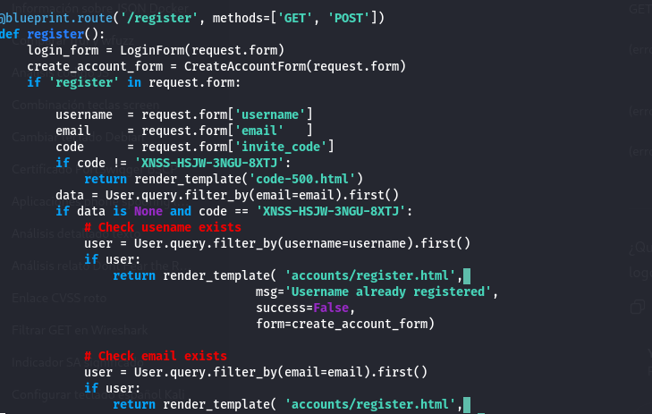

# BOLT


## Summary
Bolt is a medium-difficulty Linux machine featuring a custom web application and a Docker image that contains multiple layers with deleted files. Enumerating the deleted database files reveals credentials for an application and hints to the demo site. Further enumeration of the Docker image reveals an invitation token which allows registration on the site. The site is vulnerable to SSTI. Enumerating Passbolt configuration reveals database credentials that can be used to achieve lateral movement. The root password can be obtained by exploiting the Passbolt server.

## port Enumeration

Firs thing I did was enumerating ports using nmap.
```bash
nmap -p- --open -n -T5 -vvv -Pn 10.10.11.114
```
This reveals three open ports:
```
22/tcp  open  ssh   syn-act  ttl 63
80/tcp  open  http  syn-act  ttl 63
443/tcp open  https syn-act  ttl 63
```
I enumerate the service versions to look for possible vulnerabilities.


I can't see evident vulnerabilities here.

On ports 80 and 443 we see different pages; port 80 appears to host some kind of administration site.


And, in the port 443, we can see a passbolt instance, passbolt, a web-ui password manager, thats interesting.


But I need a valid invitation to access it, so, lets continue the enumeration.


## Wfuzz enumeration

Now, I will use wfuzz to enumerate all the posible paths and subdomains in this page.
```bash
wfuzz -c -w /usr/share/wordlists/directory-list-1.0.txt -u http://bolt.htb/FUZZ
```
I find a lot of paths in the main page.


And 2 subdomains ```mail``` and ```demo```.

```bash
wfuzz -c -w /usr/share/wordlists/subdomains-top100000.txt -u http://bolt.htb --hw 1801 -H "Host: FUZZ.bolt.htb"
```


In the subdomain demo, we find what it looks like a clone of the login page in the main page, if we use basic logic and see the name of the subdomain, we can sey that this is a demo version of the main page.


In the subdomain mail, we can see a roundcube instance.


Then, I will explore the main page, and in ```download```, I find something interesting, a docker image download.


I download the image, what seems like a flash webapp, so, lets search for posible filtred data in these files.

## Docker image enumeration


First thing I found was database files, so, lest see what is inside this.


Here we find a beautifull entrance, user admin, and a hash.


We use john and reveal the password.



I also find what seems like a invitation code.

## Web enumeration with new credentials

Then I use the admin credentials to access his profile in the main page.


I cant do a lot here.

In passbolt, admin isnt a valid user.


The same with the mail page.


In ```demo```, you cant log with admin user, BUT, with the code who I found in the docker files, I can create a demo account, so, I did exactly this.


The account that I just created works in the ```mail``` page.


So, after searching, I found a settings page, and, when I try change something, the page sends me an email.


## STTI Exploitation

And, after a bit of testing, i found a SSTI vulnerability in this exact form.


With this, first, I read /etc/password, where I can see that ```eddie``` and ```clark``` are the users names in this system.

And, of course, I made a reverse shell using that entrance.


## Local system enumeration

In the webfiles, i found the file passbolt.php, who looks like a config file for the passbolt user, and in this file, I find a database credentials.


And even better, this exact password, is the password of the user ```eddie```


Looking in the eddie's mails, I find that Clark sends a mail to Eddie telling him that if Eddie loses his passbolt priv key, that's all, he will not be able to recover it.


## Database enumeration

Using the credentials who I found in ```passbolt.php``` I can log in the passbolt database, and read it.


There we can find a lot of interesting tables, ```users``` and ```secrets```.

In ```secrets``` we found what appears to be an encrypted message. Since this is a password manager, this is likely an encrypted password.


So, at this point we need the private key to decrypt this message. I searched the local system with find.

```bash
find / -type f -exec grep -aF -l “BEGIN PGP PRIVATE KEY BLOCK”{} + 2>>/dev/null
```

## Secret message decrypt

I found it, in the crome logs.


So, after cleaning the key, I use gpg2john to extract the keys password hashes.

```bash
gpg2john eddieprivkeylimpio.txt > secret.hash
```


Then I used John the Ripper to crack the key's password.

```bash
john --wordlist=/usr/share/wordlists/rockyou.txt secret.hash
```


With this password, I imported the key into GPG.

```bash
gpg --import eddieprivkeylimpio.txt
```


With that, I decrypted the secret message I found in the database.


That password is the root password — I just need to log in to the local machine.


## Other ways

One thing who i didnt read in my firs run was that, in the passbolt db, you can find a session token.


The only active tocken is an active token, after searching in the documentation, I found how to use it.


The app will need a browser extension.


After this, it will need the priv key.


After this, you will need to use the password, so, you will need to use the gpg2john like in the last run.


And, after this, we can see the root password


You can also do the privilege scalation with ```dirty pipe```, but this vulnerability was discovered after the creation of this CTF, so it's clear that this is not the path you're supposed to take.
