# Summary

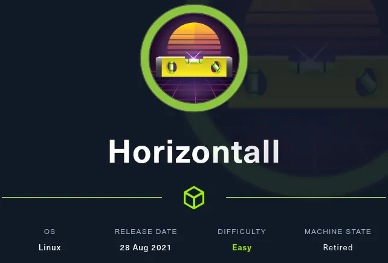


# Port enumeration

I used nmap to enumerate all the open ports.

```bash
nmap -p- -T5 -Pn -vvv -n 10.10.11.105 -oG allPorts.txt
```

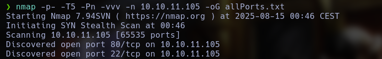

I just found 2 ports oppen, 22 and 80, ssh and http.

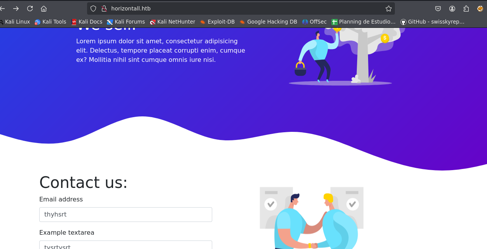

This web page is simple, I didnt found nothing there, so, I started to enumerate possible directories and subdomains.

# Subdomains enumeration

Using wfuzz, I found something interesting.

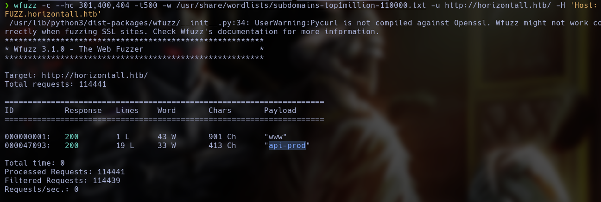

By accessing the browser's subdomain, I only found this.

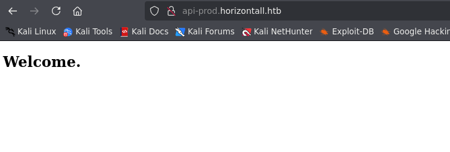

Very funny, but, after enumerate all the directorys in this subdomains, I found some interesting routes.


In reviews, I found a json with some users name.


In admin I found a strapi instance.

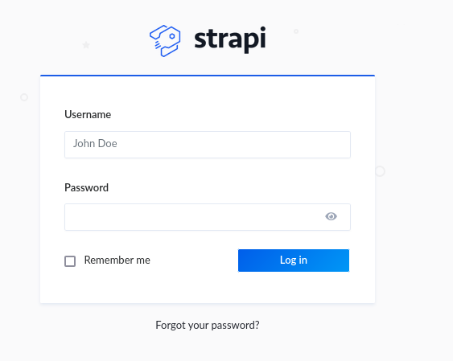

# Strapi enumeration

After reading the files, I found the strapi instance version.

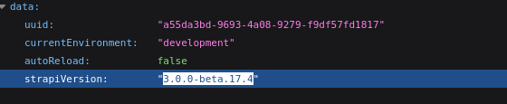

After a fast google search, I found who this version is vulnerable to CVE-2019-18818, wich allows me to reset users password abusing a vulnerable reset-password page.

# Exploiting CVE-2019-18818

I just need to send an change-password request.

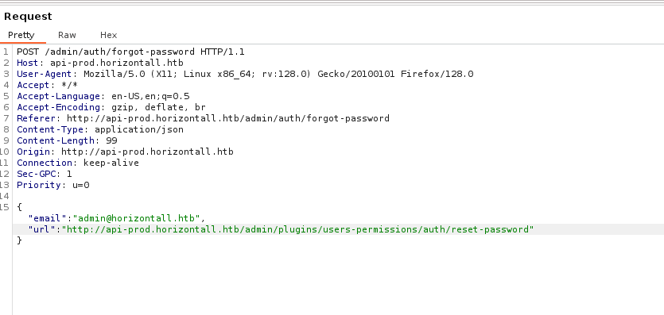

After this, the app will acept our request and we will send another request who will contain the new admin password.

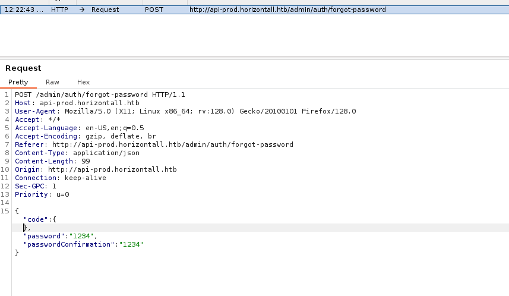

Now, I have access to the admin account.

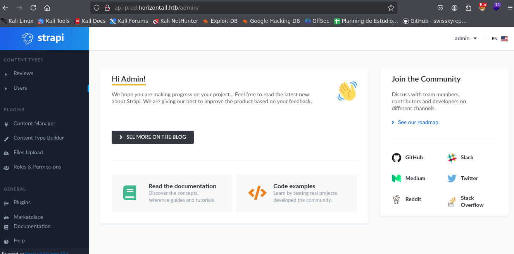

# Admin panel enumeration

After a google search, I found another exploitable vulnerability who allow me to execute Arbitrary Code Injection.

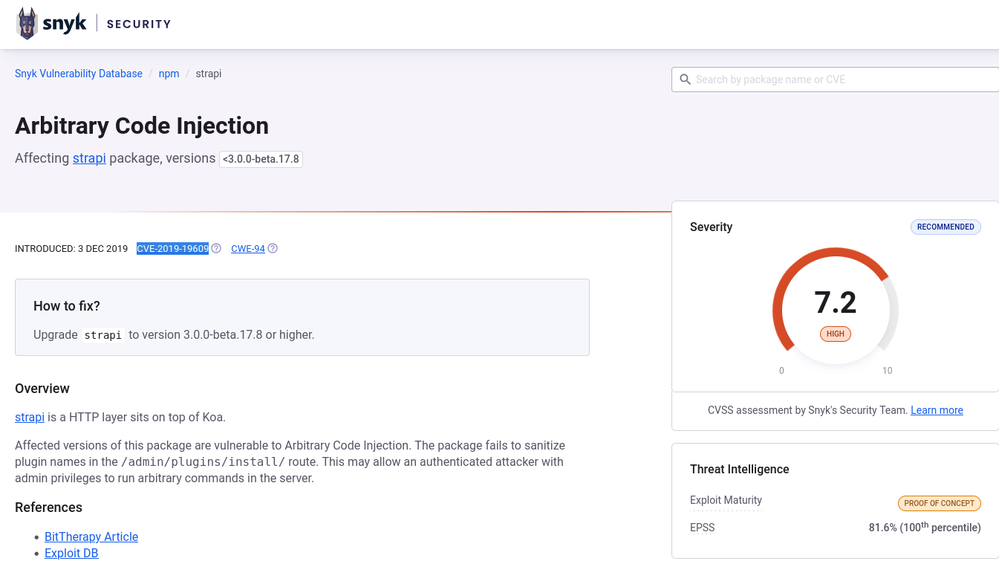

After a wile, I found an exploit.

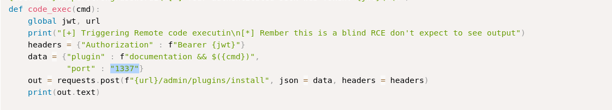

This exploit will try to install an plugin and, with the documentation, will inject the code.

# Reverse shell

With this script, I obtained an Reverse Shell

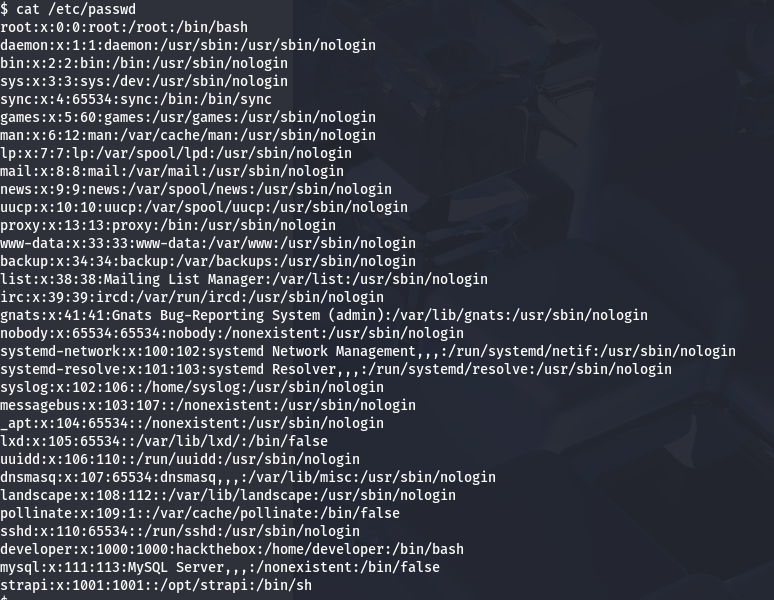

# Local enumeration

With /etc/passwd i found the 2 users, developer and strapi, I am strapi at this point.

With netstat, i found something strange working in port 8000.

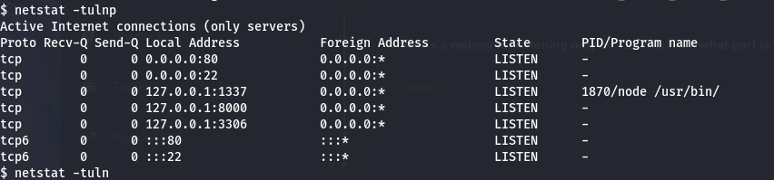

# Port fowarding

I will use chisel to redirect this service.

First, I will send the binary to the victim system.


Next, I started the server on the attacker machine.

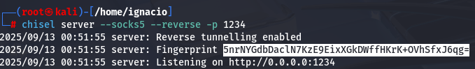

On the victim, I started the tunnel client.

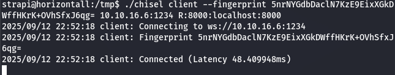

With that tunnel, I could access the hidden service, which turned out to be a Laravel instance.


# Laravel enumeration

A quick search revealed CVE-2021-3129 and an exploit that allows remote code execution.

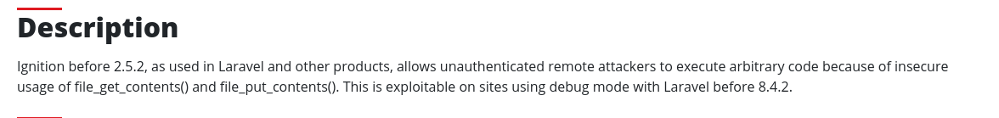

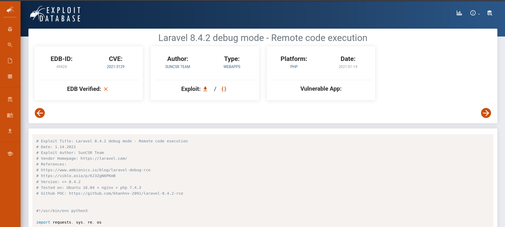

This exploit abuses two insecure functions in the PHP code, which allow us to execute commands.

After running the exploit, I found that I had become root.

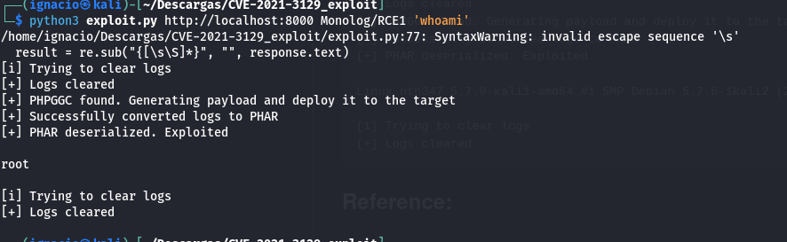