# Summary

Validation is a easy CTF from the plataform Hack The Box, where we will neet to obtain a shell with a SQLI.

# Port enumeration

With nmap I found 4 ports oppen, 22, 80, 4566 and 8080

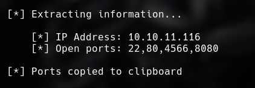

The HTTP server in port 80 was the only one with a real page working.

# Web enumeration

The only thing I can see is a form who allow me to register a username and the country where I am, the name imput wasn't vulnerable to SQLI.

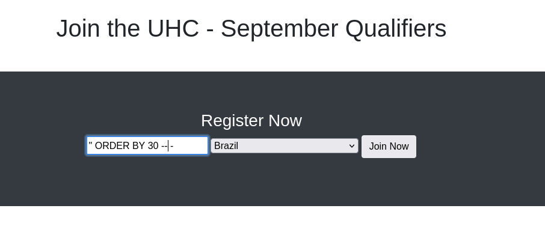

But that cannot be said about the country imput, who is completly vulnerable, we can change it with burpsuite or caido.

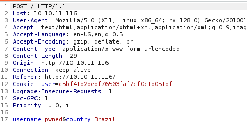

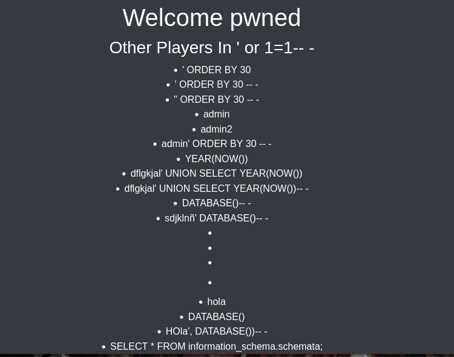

# SQLI Exploitation

Using this vector, I started to take information.

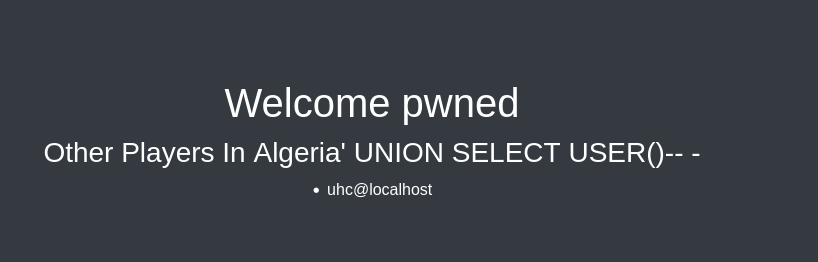

The sql user.

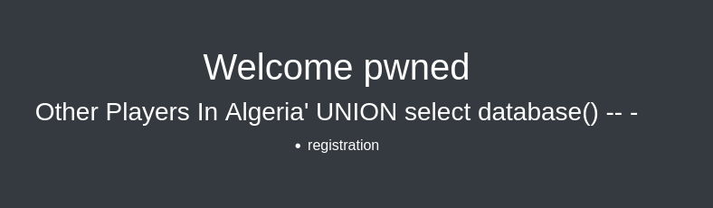

The database name.

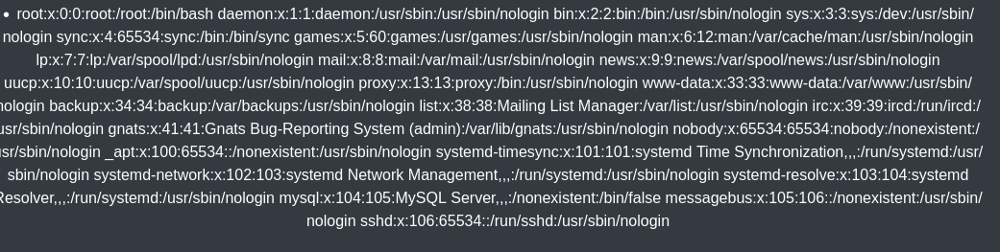

The /etc/passwd file.

## Shell

After all this, I tried to create a php shell file using SQL.

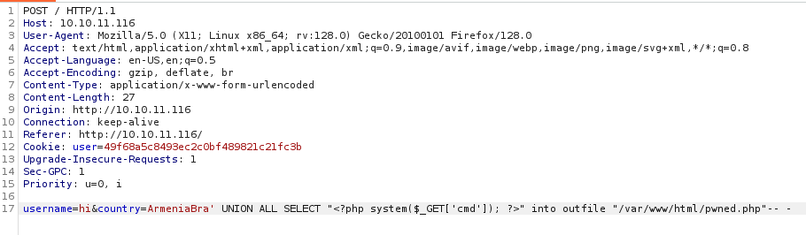

It worked

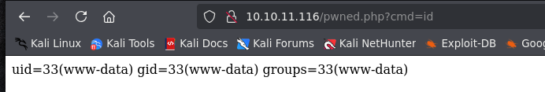

Using the same tecnique, I created a reverse shell script.

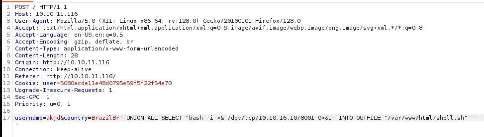

Then, I executed it using shell.php and I have my shell.

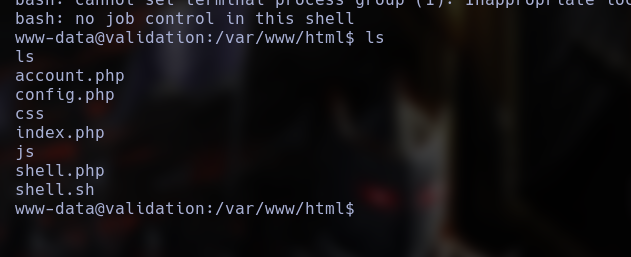

# Local enumeration

Soon I see in the file config.php the uhc user password

.png)

# Privilege scalation

Using this pasword, I was able to log as root.

.png)